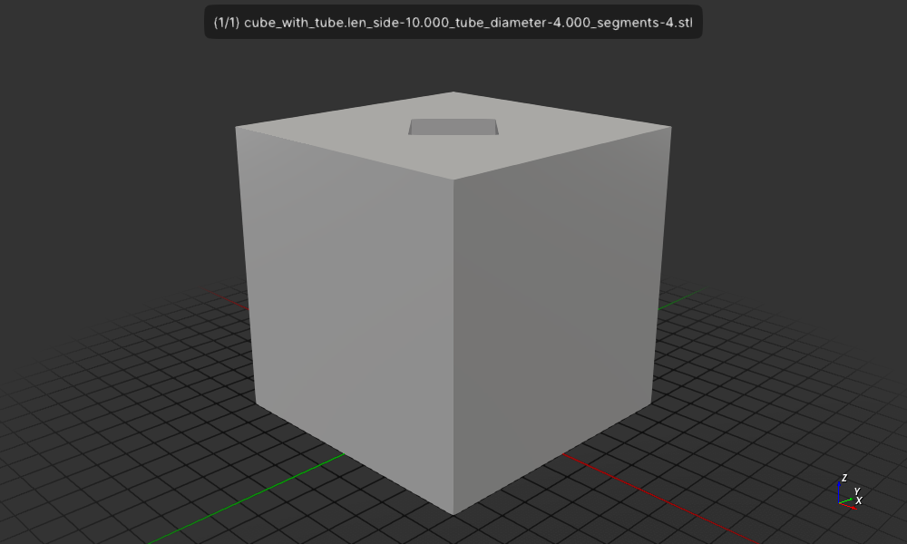

# Cube-with-tube-not-a-manifold

Create a 10mm cube with 4mm square tube and is_manifold fails:
```
$ cargo run
    Finished `dev` profile [unoptimized + debuginfo] target(s) in 0.07s
     Running `target/debug/cube-with-a-tube-not-a-manifold`
The cube_with_tube is not a manifold
```


## License

Licensed under either of

- Apache License, Version 2.0 ([LICENSE-APACHE](LICENSE-APACHE) or http://apache.org/licenses/LICENSE-2.0)
- MIT license ([LICENSE-MIT](LICENSE-MIT) or http://opensource.org/licenses/MIT)

### Contribution

Unless you explicitly state otherwise, any contribution intentionally submitted
for inclusion in the work by you, as defined in the Apache-2.0 license, shall
be dual licensed as above, without any additional terms or conditions.
